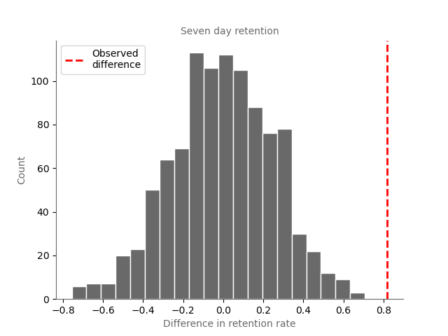

# A/B testing in mobile games

A/B testing, also known as split testing, is a widely used method in the gaming industry to optimize various aspects of computer games. The primary motivation is to make data-driven decisions that improve the overall player experience and maximize the game's success.

# Scope
All analysis will be conducted on data collected for the mobile puzzle game, Cookie Cats. In this classic "connect three" puzzle, players must strategically link tiles of identical colors to clear the board and advance through levels.

# Experimental design

In the game, players face time-based barriers or can opt for in-app purchases. We're analyzing an A/B test that shifted the initial barrier from level 30 to level 40 in Cookie Cats, focusing on its impact on player retention and game rounds.

## Hypothesis
A two-way hypothesis test at a significance "alpha" level of 0.05 will be conducted.

* **Null hypothesis**: Gate position has no impact on player retention/game rounds.

* **Alternate hypothesis**: Gate position has an impact on player retention/game rounds.

## Test statistics

The following metrics are available and will be evaluated:

1. **sum_gamerounds**: the number of game rounds played by the player during the first 14 days after install.
2. **retention_1**: did the player come back and play 1 day after installing?
3. **retention 7**: did the player come back and play 7 days after installing?

## File structure
<pre>
|- notebooks/
   |- stock_price_forecast.ipynb
   |- figures/
|- ab-testing-cookie-cats/
   |- custom_funcs.py
   |- config.py
|- data/
   |- raw/
|- README.md
</pre>

## Conclusion

Neither the number of game rounds or the one day retention rate is significantly different between the two test groups. However, the seven day retention rate is significantly higher when the first barrier is set to gate 30. I would therefore reccomend the gate remains in this position.

